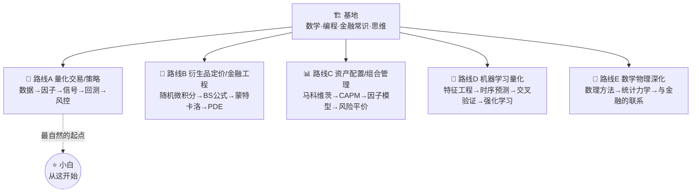

# 学习路线图

> 全局地图。先看清楚「基地」有哪些支柱、能分出哪几条路线，再决定自己怎么走。
> 原则：**基地要夯实，路线可自由分支；小白先求跑通，再回头补深度。**

---

## 一、设计哲学：基地 + 分支

很多人学量化失败，是因为陷入两个极端：

- **极端 A「无尽备课」**：立志先把数学全学完再碰量化 → 啃三年实分析，热情耗尽，一个策略没跑过。
- **极端 B「空中楼阁」**：直接抄策略代码 → 能跑，但完全不懂为什么，稍微一改就崩，遇到亏损不知所措。

本项目走中间路线：

```
        ┌─────────────────────────────────────┐
        │           分支路线（按兴趣选）          │
        │  量化交易 · 衍生品定价 · 组合管理        │
        │  机器学习量化 · 数学物理深化            │
        └───────────────▲─────────────────────┘
                        │ 站在基地上分支
        ┌───────────────┴─────────────────────┐
        │              夯实的基地                │
        │  数学 · 编程 · 金融常识 · 思维方法       │
        └─────────────────────────────────────┘
```

**怎么用**：基地不必一次学满。小白从「量化入门主线」起步，**遇到哪块基础不够，就回基地补哪块**（即时学习 just-in-time learning）。基地像工具箱，缺哪个拿哪个，而不是先把所有工具背一遍。

---

## 二、夯实的基地（四大支柱）

> 这是所有路线共享的地基。你不必现在学完，但要知道它们各自负责什么、缺了会怎样。

### 支柱 1 · 数学 🧮
| 模块 | 在量化里干什么 | 缺了会怎样 | 优先级 |
|---|---|---|---|
| 微积分 / 数学分析 | 收益率、连续复利、极值、泰勒展开 | 看不懂任何定价公式 | ⭐⭐⭐ 必备 |
| 线性代数 | 组合权重、协方差矩阵、因子模型、PCA | 不会处理多资产、多因子 | ⭐⭐⭐ 必备 |
| 概率论与数理统计 | 一切的核心：分布、期望、假设检验、回归 | 会把噪声当信号 | ⭐⭐⭐ 必备 |
| 随机过程 / 随机微积分 | 布朗运动、伊藤引理、衍生品定价 | 进不了衍生品/金融工程 | ⭐⭐ 进阶 |
| 最优化 | 组合优化、参数拟合、机器学习 | 不会「求最好」 | ⭐⭐ 进阶 |
| 时间序列 | 价格/收益建模、ARIMA、GARCH、平稳性 | 时序预测全凭感觉 | ⭐⭐ 进阶 |

### 支柱 2 · 编程 💻
| 模块 | 内容 | 优先级 |
|---|---|---|
| Python 基础 | 语法、数据结构、函数、面向对象 | ⭐⭐⭐ |
| 科学计算三件套 | **NumPy**（数组）· **Pandas**（表格/时间序列）· **Matplotlib**（画图） | ⭐⭐⭐ |
| 数据获取与清洗 | 行情数据、缺失值、对齐、复权 | ⭐⭐⭐ |
| 回测与策略框架 | backtrader / vectorbt / 自己写简易回测 | ⭐⭐ |
| C++（性能关键处） | 速度瓶颈、与 Python 混编（pybind11） | ⭐ 后期 |

### 支柱 3 · 金融常识 🏦
| 模块 | 内容 |
|---|---|
| 市场与工具 | 股票、债券、期货、期权、ETF 是什么，怎么交易 |
| 基本机制 | 报价、买卖盘、做多做空、保证金、手续费、滑点 |
| 关键概念 | 收益率、波动率、夏普比率、回撤、Beta/Alpha |

### 支柱 4 · 思维方法 🧠
> 详见 [方法论与思维模型](02-方法论与思维模型.md)。这是最容易被忽视、却决定成败的支柱：概率思维、过拟合警惕、风险优先、第一性原理。

---

## 三、五条分支路线

从基地出发，可以走向不同方向。**它们不是互斥的，但建议一次主攻一条。**



| 路线 | 一句话 | 适合谁 | 核心难点 |
|---|---|---|---|
| **A 量化交易/策略** | 用数据和规则做买卖决策，并严谨地回测验证 | 想尽快「跑出一个策略」、目标导向的人（**小白推荐起点**） | 过拟合、交易成本、幸存者偏差 |
| **B 衍生品定价/金融工程** | 给期权等衍生品定价，理解 Black-Scholes 这类公式 | 数学物理底子好、爱推导的人 | 随机微积分、伊藤引理 |
| **C 资产配置/组合管理** | 不预测涨跌，而是科学地分散与配置 | 偏稳健、偏长期投资视角的人 | 协方差估计、优化的脆弱性 |
| **D 机器学习量化** | 用 ML 从数据里找模式 | 想结合 AI 的人 | 金融数据信噪比极低、极易过拟合 |
| **E 数学物理深化** | 把数理方法学扎实，并打通它与金融的联系 | 想从物理视角理解市场（econophysics）的人 | 抽象、回报周期长 |

---

## 四、小白推荐路线（强烈建议的起步顺序）

> 目标：**4 阶段，从「量化是什么」到「能独立设计并诚实地评估一个策略」。** 每阶段都「够用就走」，缺的数学按需回基地补。

### 🟢 阶段 0：建立全局观与环境（1～2 天）
- [ ] 读完 5 份总纲 docs
- [ ] 按[环境搭建指南](05-环境搭建指南.md)配好 Python，跑通 `import pandas`
- [ ] 跑通[量化第 01 课](../量化/README.md)

### 🟢 阶段 1：手感优先 —— 数据 × Python（2～4 周）
**主线（路线A 前半）**：
- [ ] 用 Pandas 读取/处理一段真实股价数据
- [ ] 计算收益率、累计净值、移动均线，并画出来
- [ ] 实现一个最朴素的「均线交叉」策略并粗略回测
**按需补基地**：NumPy/Pandas 基础（编程支柱）；收益率/波动率（金融支柱）

### 🟡 阶段 2：诚实地评估 —— 概率统计 × 回测严谨性（4～8 周）
> 这是分水岭。大多数人卡在这：**学会区分「真信号」和「运气」。**
- [ ] 夏普比率、最大回撤、胜率、盈亏比怎么算、怎么解读
- [ ] 交易成本、滑点、前视偏差、幸存者偏差——给上一阶段的策略「祛魅」
- [ ] 样本内 vs 样本外、过拟合的直观演示
**按需补基地**：概率论、假设检验、回归（数学支柱）

### 🟡 阶段 3：选一条分支深入（持续）
打好前两阶段后，按兴趣选 B/C/D/E 之一深入。例如：
- 爱推导 → 路线 B：从随机微积分到 Black-Scholes
- 偏稳健 → 路线 C：从马科维茨到因子模型
- 爱 AI → 路线 D：但要带着阶段 2 的「过拟合警惕」上路

---

## 五、节奏与心法

- **节奏**：每周稳定推进 > 偶尔爆肝。建议每个学习单元控制在 1～2 小时，配一段可运行代码。
- **顺序**：**先会用 → 再理解 → 最后批判**。先让策略跑起来拿正反馈，再回头抠数学，最后追问「它什么时候会失效」。
- **缺数学不要慌**：本路线图刻意把数学「拆散」到用得着的地方。看到不懂的数学，回[基础/数学](../基础/数学/)对应模块补一小块，然后立刻回来用。
- **C++ 何时学**：等你有了能跑的 Python 策略、并遇到「太慢了」的真实瓶颈时再学。过早优化是浪费。

---

下一份 👉 [方法论与思维模型](02-方法论与思维模型.md)
