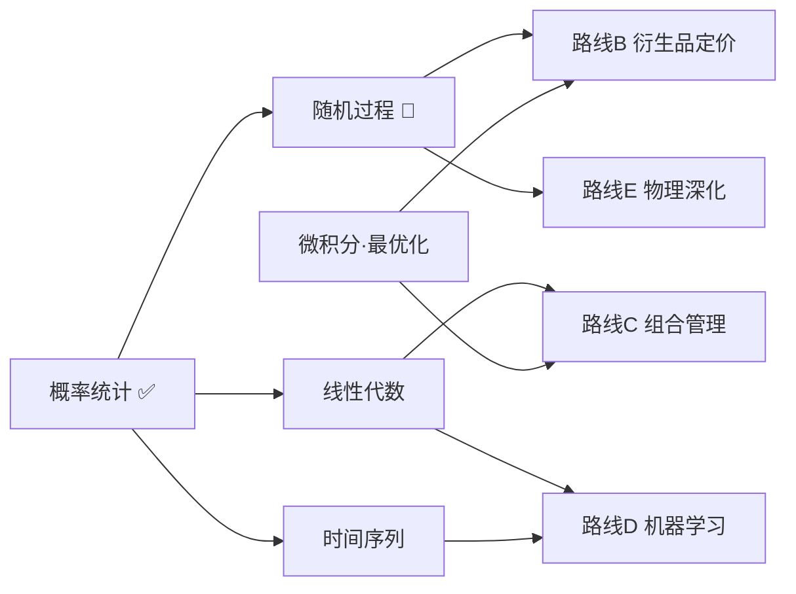

# 深入学习大纲（多轮逐步推进）

> 这份文档是「全部详细做」的**总作战地图**。把所有要深入讲透的模块列在这里，按依赖顺序排好，
> 每完成一个就打勾。它和[学习路线图](01-学习路线图.md)的区别：路线图是「全局方向」，这份是「逐模块的施工清单」。

---

## 每个模块都用同一套「讲透」模板

为了真正**教会**一个小白（而不是甩公式），每个模块的笔记都遵循这个结构——它本身就是一种[方法论](02-方法论与思维模型.md)：

1. **本质（一句话）+ 第一性原理**：剥到最底层，这东西到底在干嘛、为什么存在。
2. **从最简单的例子出发**：先给一个具体到不能再具体的例子（抛硬币、一块田），再慢慢抽象。
3. **底层逻辑 / 推导**：不背公式，而是看着它**长出来**——每一步「为什么」。
4. **思维模型**：这个知识背后可迁移的思考方式。
5. **哲学指导 / 局限**：它的世界观是什么？什么时候会骗你？
6. **动手代码**：可运行、可视化，亲手获得手感。
7. **与已学知识闭环**：把它和你学过的（前面的课）连起来，"原来如此！"
8. **费曼小结 + 思考题**：用人话复述，带着问题走。

> 📌 学习心法（再强调）：**先具体后抽象、先会用后理解、先模仿后批判。** 看不懂就回到「最简单的例子」和「动手代码」，别硬啃公式。

---

## 第一部分：深化数学基地 🧮（底层工具，优先）

> 这些是所有分支共享的地基。我们用「第一性原理 + 模拟」的方式讲，让你**看见**数学，而不是背它。

| # | 模块 | 一句话本质 | 解锁什么 | 状态 |
|---|---|---|---|---|
| 1 | [概率统计·区分信号与噪声](../基础/数学/概率统计-区分信号与噪声/) | 把"是真本事还是运气"变成可计算 | 一切的判断基础 | ✅ 完成 |
| 2 | [随机过程·从抛硬币到布朗运动](../基础/数学/随机过程-从抛硬币到布朗运动/) | 随机性如何随时间演化 | 衍生品定价、风险、GBM 的来历 | ✅ 完成 |
| 3 | [线性代数·组合与协方差的几何](../基础/数学/线性代数-组合与协方差的几何/) | 用向量/矩阵同时处理一篮子资产 | 组合管理、因子模型、PCA | ✅ 完成 |
| 4 | [微积分与最优化·复利·泰勒·找最优](../基础/数学/微积分与最优化-复利泰勒与找最优/) | 变化率与"求最好" | 定价、参数拟合、组合优化 | ✅ 完成 |
| 5 | [时间序列·价格的记忆与平稳性](../基础/数学/时间序列-价格的记忆与平稳性/) | 价格有没有"记忆"、能不能预测 | 信号建模、均值回归、波动率 | ✅ 完成 |

## 第二部分：分支路线 🌿（在基地上深入）

| 路线 | 模块主题 | 依赖 | 状态 |
|---|---|---|---|
| **A 量化交易** | 主线 01–05（数据→风险→策略→祛魅） | —— | ✅ 第一阶段完成 |
| **A+ 实战进阶** | 仓位管理/Kelly → 端到端项目 → 回测框架 → 模拟盘（[子模块](../量化/路线A+实战进阶/)） | 主线 | ✅ **全部完成**（A+1·A+2·A+3·A+4）|
| **B 衍生品定价** | 无套利→二叉树→Black-Scholes→蒙特卡洛→热方程（[5个子模块](../量化/路线B-衍生品定价/)） | 模块2,4 | ✅ **全部完成**（B1·B2·B3·B4·B5）|
| **C 组合管理** | 马科维茨 → CAPM → 因子模型 → 风险平价（[子模块](../量化/路线C-组合管理/)） | 模块1,3 | ✅ **全部完成**（C1·C2·C3·C4）|
| **D 机器学习量化** | 偏差方差 → 金融的ML困境 → 树模型 → 诚实策略（[子模块](../量化/路线D-机器学习量化/)） | 模块1,3,5 | ✅ **全部完成**（D1·D2·D3·D4）|
| **E 数学物理深化** | 厚尾幂律 → 反常扩散 → 崩盘相变 → 统计力学（[子模块](../量化/路线E-数学物理深化/)） | 模块2、路线B | ✅ **全部完成**（E1·E2·E3·E4）|

## 第三部分：编程深化 💻

| 模块 | 主题 | 状态 |
|---|---|---|
| Python 进阶 | 向量化思维、pandas 时序、画图进阶 | 🔜 |
| C++ 与混编 | 性能瓶颈、pybind11、QuantLib 入门 | 🔜（遇到真实瓶颈再上）|

## 第四部分：进阶深水区 🌊（按需深化，专业级）

> 现有路线是"入门→中级"的广度地图；这里是各领域往下挖的"研究生/从业级"深度。

| 进阶路线 | 主题 | 状态 |
|---|---|---|
| [统计套利与协整](../量化/进阶-统计套利与协整/) | 协整/配对交易、OU、Johansen、Kalman 动态对冲 | 🔨 进行中（①协整配对 ②Kalman动态对冲 ✅）|
| [物理味进阶](../量化/进阶-物理味进阶/) | 随机矩阵清洗协方差、随机波动率(Heston)、Hawkes 自激过程 | 🔨 进行中（①随机矩阵 ②Heston ③Hawkes ✅）|
| [金融机器学习进阶](../量化/进阶-金融机器学习进阶/) | 三重栅栏标注、元标注、分数阶差分、组合purged CV、PBO、特征重要性 | 🔨 进行中（①三重栅栏+元标注 ②分数差分+PurgedCV+PBO ③特征重要性陷阱 ✅）|
| [微观结构与执行](../量化/进阶-微观结构与执行/) | 订单簿、价格冲击、Almgren-Chriss 最优执行、做市 | 🔨 进行中（①最优执行Almgren-Chriss ②做市与逆向选择 ✅）|
| [综合实战](../量化/进阶-综合实战/) | 端到端流水线、诚实瀑布、把全部进阶武器串起来 | 🔨 进行中（①端到端诚实流水线 ✅）|
| 编程深化（C++） | pybind11 把热点循环搬到 C++ 加速 | 🔨 进行中（①蒙特卡洛加速 ✅，见 [编程深化/](../量化/进阶-编程深化/)）|

> 📖 进阶思维：[量化思维模型大全](11-量化思维模型大全.md)——把全项目的"怎么想"汇成一件武器。
> 🗺️ 学到后期总复习：[总复习·全项目知识地图](12-总复习知识地图.md)。

## 第五部分：本土化与工具 🇨🇳🛠️

| 模块 | 主题 | 状态 |
|---|---|---|
| [中国市场特殊性](../量化/中国市场特殊性/) | A股规则与坑：T+1、涨跌停、印花税、做空难、停牌 | ✅ 可学 |
| [工具/运行全部.py](../工具/运行全部.py) | 一键跑通所有脚本+生成全部配图 | ✅ |
| [工具/中文字体.py](../工具/中文字体.py) | 让图表显示中文（可选） | ✅ |
| [工具/生成Notebook.py](../工具/生成Notebook.py) | 把课程 .py 转成交互式 Jupyter notebook（小白更友好） | ✅（关键课已生成示例 .ipynb）|

---

## 推进顺序与依赖

**默认推进路径**：先把数学基地（模块 2→3→4→5）逐个讲透，每打好一块就能解锁对应分支；其间穿插分支路线的深入。你随时可以指定优先做某一块。

---

## 进度总览

- ✅ 基地总纲（5 份 docs）
- ✅ 量化主线第一阶段（01–05）
- ✅ **数学地基全部完成**：概率统计 · 随机过程 · 线性代数 · 微积分与最优化 · 时间序列
- ✅ **路线 B 衍生品定价全部完成**：B1 无套利 · B2 二叉树风险中性 · B3 Black-Scholes · B4 蒙特卡洛 · B5 BS=热方程
- ✅ **路线 C 组合管理全部完成**：C1 有效前沿 · C2 CAPM与Beta · C3 因子模型 · C4 风险平价与脆弱性
- ✅ **路线 D 机器学习量化全部完成**：D1 偏差方差 · D2 金融是ML地狱 · D3 树模型 · D4 诚实策略与现实
- ✅ **路线 E 数学物理深化全部完成**：E1 厚尾幂律 · E2 反常扩散Lévy分形 · E3 崩盘相变 · E4 统计力学收官
- ✅ **进阶深水区四条线全部开张**：统计套利（协整配对 · Kalman 动态对冲）· 物理味（随机矩阵 · Heston · Hawkes）· 金融ML（三重栅栏+元标注 · 诚实三件套 · 特征重要性陷阱）· 微观结构（最优执行 · 做市）
- 🎉 **整个深入大纲到此完成**：数学地基 5/5 + 五条分支路线（A–E）全部讲透 + 四条进阶线各 2–3 模块。全项目总收束见 [E4 笔记](../量化/路线E-数学物理深化/04-统计力学看市场收官/笔记.md)。
- 🗺️ **总复习**：学到后期回头串联,看 [12 总复习·全项目知识地图](12-总复习知识地图.md)——把 40+ 模块按"反复出现的 8 个思维模型"织成一张网。

> 这是一场马拉松，不是冲刺。**每轮深入一两个模块，稳扎稳打。** 学完一个模块，回来这里打勾，git 历史就是你的成长轨迹。
